# 🛍️ CozyCoCart Ecommerce

**CozyCoCart** — "Cozy" means **comfortable** and "Cart" refers to your **online shopping basket**. Together, it reflects a seamless, user-friendly, and cozy shopping experience. This lightweight eCommerce platform is developed using **HTML**, **CSS**, and **Vanilla JavaScript**, focused on learning and implementing **data manipulation** and **LocalStorage CRUD operations**.

---

## 🚀 Features

* 🛒 Add products to cart
* ✏️ Update product quantity
* 💾 Persistent data storage using LocalStorage
* 🔐 Login and Sign Up (simulated auth via LocalStorage)
* 🔍 Product search functionality
* 👨‍💼 Admin dashboard to manage products
* 💸 eWallet option for payment
* 🔄 Real-time DOM updates
* 📱 Fully responsive design

---

## 🧰 Tech Stack

* HTML5
* CSS3 (UI Design)
* JavaScript (ES6+)
* LocalStorage for data persistence
* FontAwesome Icons

---

## 📁 Project Structure

```
cozycocart/
├── css/                  # Styling files
├── img/                  # Image assets
├── js/                   # JavaScript logic
├── admin.html            # Admin dashboard
├── basket-page.html      # Payment page (user info + eWallet)
├── category-page.html    # Categories listing
├── homepage.html         # Main landing page
├── index.html            # Entry point or login/signup redirect
├── product-info.html     # Product detail view
├── received-items.html   # Orders, Cart, eWallet, Profile
└── readme.md             # Project documentation
```

---

## 🧠 JavaScript Highlights

* DOM Manipulation
* Event Listeners
* LocalStorage CRUD:

  * **Create** – Add new products, users, cart items
  * **Read** – Retrieve data for users, cart, and products
  * **Update** – Modify eWallet balance, quantities, etc.
  * **Delete** – Admin product removal or item clearing
* Data structures: Arrays, Objects, JSON
* Auth simulation with LocalStorage

---

## 🔧 Getting Started

1. **Clone the Repository**

```bash
git clone https://github.com/yourusername/cozycocart.git
cd cozycocart
```

2. **Run Locally**

Just open `index.html` in your browser, or use a live server extension for better routing.

3. **Explore Pages**

* `index.html`: Redirect to login/signup
* `homepage.html`: View featured products
* `basket-page.html`: Payment page (user info + eWallet)
* `product-info.html`: Product details
* `category-page.html`: Categories
* `received-items.html`: Orders, Cart, eWallet, and Profile
* `admin.html`: Admin dashboard

---

## 🗂️ Page Overview

### `index.html`

* Entry point with login/signup redirection logic.
  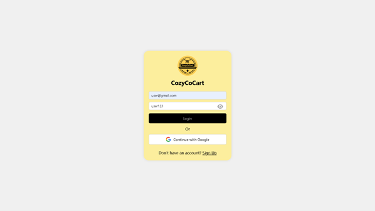


* Account creation page for new users.
  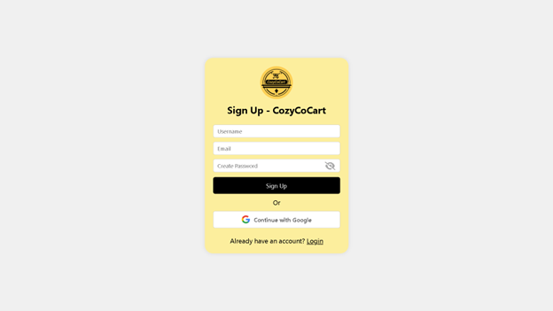

### `homepage.html`

* Main landing page displaying featured products and navigation.
  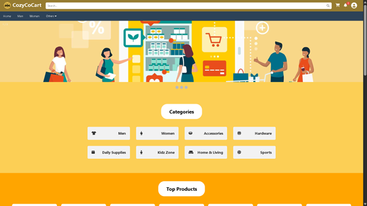
  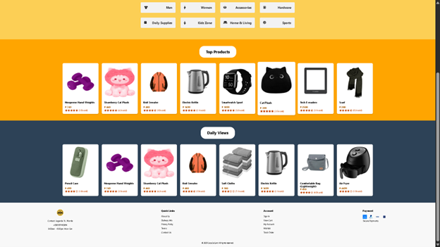

### `basket-page.html`

* Payment page including user information and eWallet checkout.
  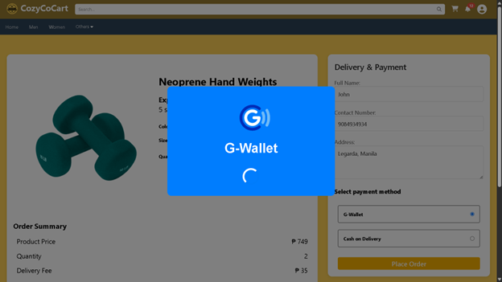
  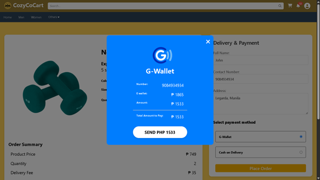

### `product-info.html`

* Detailed view of a selected product with cart interaction.
  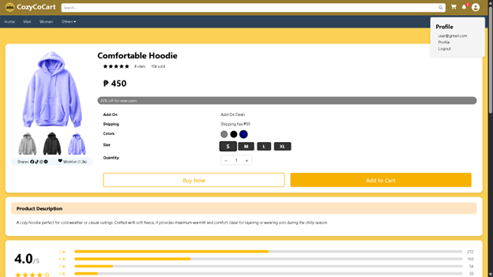
  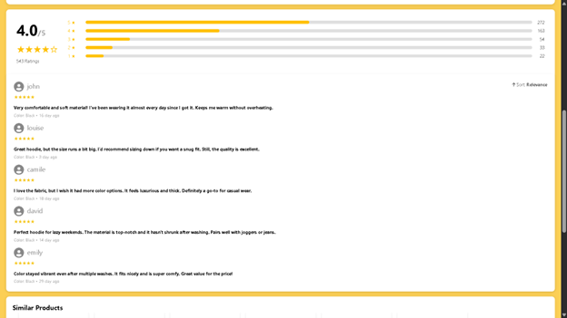
  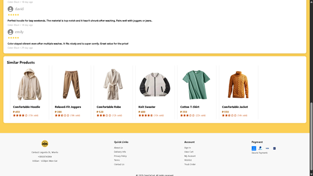

### `category-page.html`

* View products filtered by category.
  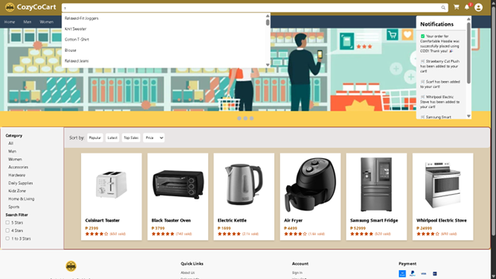

### `received-items.html`

* Displays orders, cart items, eWallet status, and profile update section.
  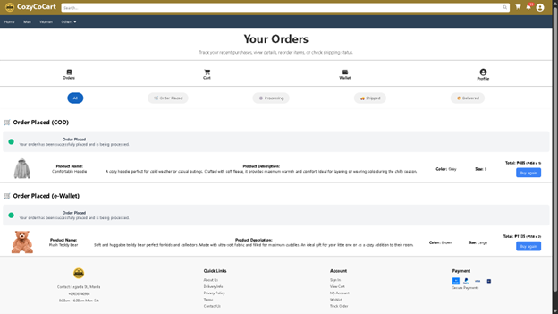
  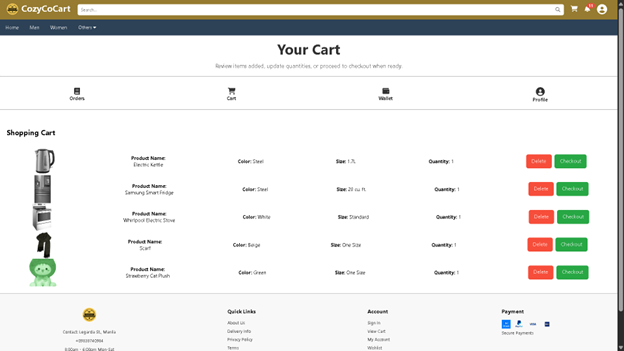
  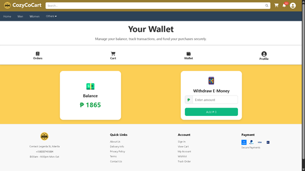
  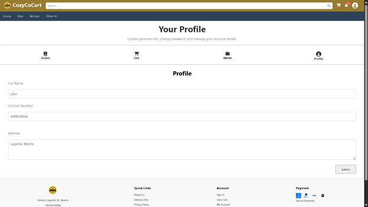

### `admin.html`

* Admin dashboard to manage inventory and logs.
  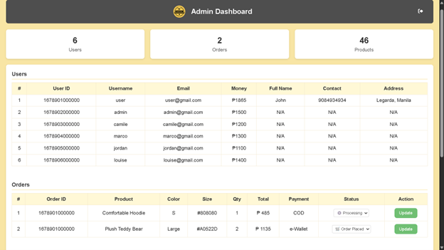
  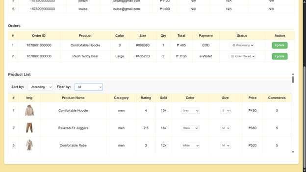

---

## 🙌 Author

Created with 🤍 by the three founders of CozyCoCart.

---

## 📄 License

This project is open-sourced under the MIT License.
